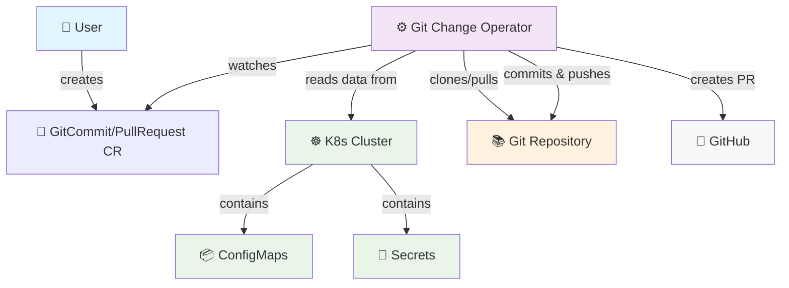

# git-change-operator


[](https://github.com/mihaigalos/git-change-operator/actions/workflows/ci.yaml)
[](https://github.com/mihaigalos/git-change-operator/actions/workflows/docker-build.yaml)
[](https://github.com/mihaigalos/git-change-operator/actions/workflows/helm-chart.yaml)
[](https://github.com/mihaigalos/git-change-operator/actions/workflows/mkdocs.yaml)

A Kubernetes operator that enables automated Git operations from within your cluster. Commit files directly or reference existing Kubernetes resources (Secrets, ConfigMaps, etc.) and push them to Git repositories with flexible output strategies.

## Features

- **Direct File Commits**: Commit static file content to Git repositories
- **Resource References**: Reference arbitrary Kubernetes resources and commit their data
- **Flexible Output Strategies**: 
  - Dump entire resources as YAML
  - Extract all resource fields as separate files
  - Extract specific fields with custom naming
- **Write Modes**: Overwrite or append to existing files
- **Git Operations**: Support for both direct commits and pull requests
- **Secure Authentication**: Uses Kubernetes Secrets for Git authentication

## Minimal demo
```yaml
apiVersion: gco.galos.one/v1
kind: GitCommit
metadata:
  name: resource-backup
  namespace: my-namespace
spec:
  repository:
    url: "https://github.com/your-username/k8s-backups.git"
    branch: "main"

  auth:
    secretName: "git-credentials"

  commit:
    author: "Git Change Operator <gco@example.com>"
    message: "Automated backup of cluster resources"

  resourceReferences:
    # Backup ConfigMap as complete YAML
    - name: "app-config"
      apiVersion: "v1"
      kind: "ConfigMap"
      namespace: "default"
      strategy: "dump"
      output:
        path: "backups/configmaps/app-config.yaml"
```

## Minimal demo using self-hosted Kind cluster

Please have a token (preferably fine-grained) with fine-grained permissions ready, the following step asks for it:

```bash
make kind-full-demo
```

## Resource Reference Capabilities

The operator can reference any Kubernetes resource and extract its data using various strategies:

### Output Strategies
1. **Dump**: Output entire resource as YAML
2. **Fields**: Extract all data fields as separate files  
3. **Single-Field**: Extract specific fields with custom naming

### Write Modes
- **Overwrite**: Replace file content (default)
- **Append**: Add to existing file content

## Architecture



## Use Cases

### Configuration Management
Export cluster configuration to Git repositories for backup and version control.

### GitOps Workflows
Automatically update Git repositories when cluster state changes, enabling bidirectional GitOps.

### Compliance & Auditing
Maintain Git history of configuration changes for compliance and audit trails.

### Multi-Cluster Synchronization
Share configuration between clusters through Git repositories.

## Quick Navigation

<div class="grid cards" markdown>

-   :material-rocket-launch:{ .lg .middle } **Get Started**

    ---

    Install the operator and create your first GitCommit resource in minutes.

    [:octicons-arrow-right-24: Quick Start](docs/user-guide/quick-start.md)

-   :material-book-open:{ .lg .middle } **User Guide**

    ---

    Complete guide covering installation, configuration, and usage patterns.

    [:octicons-arrow-right-24: User Guide](docs/user-guide/index.md)

-   :material-code-braces:{ .lg .middle } **Examples**

    ---

    Real-world examples and use cases with complete YAML configurations.

    [:octicons-arrow-right-24: Examples](docs/examples/index.md)

-   :material-api:{ .lg .middle } **API Reference**

    ---

    Complete API documentation and CRD specifications.

    [:octicons-arrow-right-24: Reference](docs/reference/index.md)

-   :material-shield-check:{ .lg .middle } **Security**

    ---

    Production security considerations and RBAC configuration.

    [:octicons-arrow-right-24: Security Considerations](docs/security.md)

</div>

## License

This project is licensed under the MIT License - see the [LICENSE](https://github.com/mihaigalos/git-change-operator/blob/main/LICENSE) file for details.
