[](https://github.com/mihaigalos/git-change-operator/actions/workflows/ci.yaml)
[](https://github.com/mihaigalos/git-change-operator/actions/workflows/docker-build.yaml)
[](https://github.com/mihaigalos/git-change-operator/actions/workflows/helm-chart.yaml)
[](https://github.com/mihaigalos/git-change-operator/actions/workflows/mkdocs.yaml)

A Kubernetes operator that enables automated Git operations from within clusters. Commit files directly or reference existing Kubernetes resources (encrypt Secrets, ConfigMaps, etc.) and push them to Git repositories with flexible output strategies.

Docs: https://gco.galos.one

## Features

- **Operator-Managed Deployment**: Deploy using the `GitChangeOperator` CR that manages all operator resources
- **Direct File Commits**: Commit static file content to Git repositories
- **Resource References**: Reference arbitrary Kubernetes resources and commit their data
- **REST API Integration**: Fetch data from REST APIs with CEL-based response processing
  - CEL (Common Expression Language) for powerful condition evaluation
  - Dynamic data extraction and formatting from JSON responses
  - Conditional processing based on API response status
- **Flexible Output Strategies**: 
  - Dump entire resources as YAML
  - Extract all resource fields as separate files
  - Extract specific fields with custom naming
- **Write Modes**: Overwrite or append to existing files
- **Git Operations**: Support for both direct commits and pull requests
- **File Encryption**: Age-based encryption with support for SSH keys, age keys, and passphrases
- **Secure Authentication**: Uses Kubernetes Secrets for Git authentication

## Installation

### Bootstrap Deployment

Install the operator using Helm or Kustomize:

**Helm (Production):**
```bash
helm repo add git-change-operator https://mihaigalos.github.io/git-change-operator
helm install git-change-operator git-change-operator/git-change-operator
```

**Kustomize (Development):**
```bash
kubectl apply -k config/
# or: just install
```

This deploys the bootstrap resources:
- Operator Deployment with ServiceAccount
- ClusterRole and ClusterRoleBinding (RBAC)
- CRDs (GitCommit, PullRequest, GitChangeOperator)

### Optional: Configure Operator Runtime

Create a `GitChangeOperator` CR to dynamically configure the running operator:

```yaml
apiVersion: gco.galos.one/v1
kind: GitChangeOperator
metadata:
  name: git-change-operator-config
  namespace: git-change-operator-system
spec:
  replicaCount: 2  # Scale operator
  image:
    repository: ghcr.io/mihaigalos/git-change-operator
    tag: v1.2.0  # Update image version
  metrics:
    enabled: true
```

The `GitChangeOperator` CR allows runtime reconfiguration without redeploying Helm.

**Architecture:**
- **config/** → Dev deployment with Kustomize (symlinked to helm CRDs)
- **helm/** → Production Helm chart (published to helm-chart branch)
- **GitChangeOperator CR** → Optional runtime configuration
- **GitCommit/PullRequest CRs** → Main user-facing resources for git operations

## Minimal demo
```yaml
apiVersion: gco.galos.one/v1
kind: GitCommit
metadata:
  name: resource-backup
  namespace: my-namespace
spec:
  repository:
    url: "https://github.com/your-username/k8s-backups.git"
    branch: "main"

  auth:
    secretName: "git-credentials"

  commit:
    author: "Git Change Operator <gco@example.com>"
    message: "Automated backup of cluster resources"

  resourceReferences:
    # Backup ConfigMap as complete YAML
    - name: "app-config"
      apiVersion: "v1"
      kind: "ConfigMap"
      namespace: "default"
      strategy: "dump"
      output:
        path: "backups/configmaps/app-config.yaml"
```

## Minimal demo using self-hosted Kind cluster

Please have a token (preferably fine-grained) with fine-grained permissions ready, the following step asks for it if not already present in a git-ignored file called `token` in this repo.

```bash
just kind-full-demo
```

## Resource Reference Capabilities

The operator can reference any Kubernetes resource and extract its data using various strategies:

### Output Strategies
1. **Dump**: Output entire resource as YAML
2. **Fields**: Extract all data fields as separate files  
3. **Single-Field**: Extract specific fields with custom naming

### Write Modes
- **Overwrite**: Replace file content (default)
- **Append**: Add to existing file content

## Architecture

```mermaid
graph TB
    %% User creates resources
    User["👤 User"] -->|creates| A["📄 GitCommit/PullRequest CR"]
    
    %% Operator watches and processes
    B["⚙️ Git Change Operator"] -->|watches| A
    
    %% Operator reads from K8s Cluster
    B -->|reads data from| D["☸️ K8s Cluster"]
    D -->|contains| E["📦 Resources"]
    
    %% Operator authenticates and writes to Git
    B -->|clones/pulls| C["📚 Git Repository"]
    B -->|commits & pushes| C
    B -->|creates PR| G["🐙 GitHub"]
    
    %% Repository states
    
    %% Styling
    classDef userAction fill:#e1f5fe
    classDef operator fill:#f3e5f5
    classDef k8sResource fill:#e8f5e8
    classDef gitResource fill:#fff3e0
    classDef github fill:#f6f8fa
    
    class User userAction
    class B operator
    class D,E,F k8sResource
    class C gitResource
    class G github
```



## Use Cases

### Configuration Management
Export cluster configuration to Git repositories for backup and version control.

### GitOps Workflows
Automatically update Git repositories when cluster state changes, enabling bidirectional GitOps.

### Compliance & Auditing
Maintain Git history of configuration changes for compliance and audit trails.

### Multi-Cluster Synchronization
Share configuration between clusters through Git repositories.

## Quick Navigation

<div class="grid cards" markdown>

-   :material-rocket-launch:{ .lg .middle } **Get Started**

    ---

    Install the operator and create a first GitCommit resource in minutes.

    [:octicons-arrow-right-24: Quick Start](docs/user-guide/quick-start.md)

-   :material-book-open:{ .lg .middle } **User Guide**

    ---

    Complete guide covering installation, configuration, and usage patterns.

    [:octicons-arrow-right-24: User Guide](docs/user-guide/index.md)

-   :material-code-braces:{ .lg .middle } **Examples**

    ---

    Real-world examples and use cases with complete YAML configurations.

    [:octicons-arrow-right-24: Examples](docs/examples/index.md)

-   :material-api:{ .lg .middle } **API Reference**

    ---

    Complete API documentation and CRD specifications.

    [:octicons-arrow-right-24: Reference](docs/reference/index.md)

-   :material-shield-check:{ .lg .middle } **Security**

    ---

    Production security considerations and RBAC configuration.

    [:octicons-arrow-right-24: Security Considerations](docs/security.md)

</div>

## License

This project is licensed under the MIT License - see the [LICENSE](https://github.com/mihaigalos/git-change-operator/blob/main/LICENSE) file for details.
