# git-change-operator

&nbsp;

&nbsp;

A Kubernetes operator that enables automated Git operations from within your cluster. Commit files directly or reference existing Kubernetes resources (Secrets, ConfigMaps, etc.) and push them to Git repositories with flexible output strategies.

## Features

- **Direct File Commits**: Commit static file content to Git repositories
- **Resource References**: Reference arbitrary Kubernetes resources and commit their data
- **Flexible Output Strategies**: 
  - Dump entire resources as YAML
  - Extract all resource fields as separate files
  - Extract specific fields with custom naming
- **Write Modes**: Overwrite or append to existing files
- **Git Operations**: Support for both direct commits and pull requests
- **Secure Authentication**: Uses Kubernetes Secrets for Git authentication

## Resource Reference Capabilities

The operator can reference any Kubernetes resource and extract its data using various strategies:

### Output Strategies
1. **Dump**: Output entire resource as YAML
2. **Fields**: Extract all data fields as separate files  
3. **Single-Field**: Extract specific fields with custom naming

### Write Modes
- **Overwrite**: Replace file content (default)
- **Append**: Add to existing file content

## Architecture

```mermaid
graph TB
    %%{init: {"theme": "default", "themeVariables": { "background": "#ffffff"}}}%%

    %% User creates resources
    User["👤 User"] -->|creates| A["📄 GitCommit/PullRequest CR"]
    
    %% Operator watches and processes
    B["⚙️ Git Change Operator"] -->|watches| A
    
    %% Operator reads from K8s Cluster
    B -->|reads data from| D["☸️ K8s Cluster"]
    D -->|contains| E["📦 ConfigMaps"]
    D -->|contains| F["🔐 Secrets"] 
    
    %% Operator authenticates and writes to Git
    B -->|clones/pulls| C["📚 Git Repository"]
    B -->|commits & pushes| C
    B -->|creates PR| G["🐙 GitHub"]
    
    %% Repository states
    
    %% Styling
    classDef userAction fill:#e1f5fe
    classDef operator fill:#f3e5f5
    classDef k8sResource fill:#e8f5e8
    classDef gitResource fill:#fff3e0
    classDef github fill:#f6f8fa
    
    class User userAction
    class B operator
    class D,E,F k8sResource
    class C gitResource
    class G github
```

## Use Cases

### Configuration Management
Export cluster configuration to Git repositories for backup and version control.

### GitOps Workflows
Automatically update Git repositories when cluster state changes, enabling bidirectional GitOps.

### Compliance & Auditing
Maintain Git history of configuration changes for compliance and audit trails.

### Multi-Cluster Synchronization
Share configuration between clusters through Git repositories.

## Quick Navigation

-   :material-rocket-launch:{ .lg .middle } **Get Started**

    ---

    Install the operator and create your first GitCommit resource in minutes.

    [:octicons-arrow-right-24: Quick Start](user-guide/quick-start.md)

-   :material-book-open:{ .lg .middle } **User Guide**

    ---

    Complete guide covering installation, configuration, and usage patterns.

    [:octicons-arrow-right-24: User Guide](user-guide/index.md)

-   :material-code-braces:{ .lg .middle } **Examples**

    ---

    Real-world examples and use cases with complete YAML configurations.

    [:octicons-arrow-right-24: Examples](examples/index.md)

-   :material-api:{ .lg .middle } **API Reference**

    ---

    Complete API documentation and CRD specifications.

    [:octicons-arrow-right-24: Reference](reference/index.md)

## Community & Support

- **GitHub**: [mihaigalos/git-change-operator](https://github.com/mihaigalos/git-change-operator)
- **Issues**: Report bugs and request features on GitHub Issues
- **Discussions**: Join the community discussions for questions and ideas

## License

This project is licensed under the MIT License - see the [LICENSE](https://github.com/mihaigalos/git-change-operator/blob/main/LICENSE) file for details.