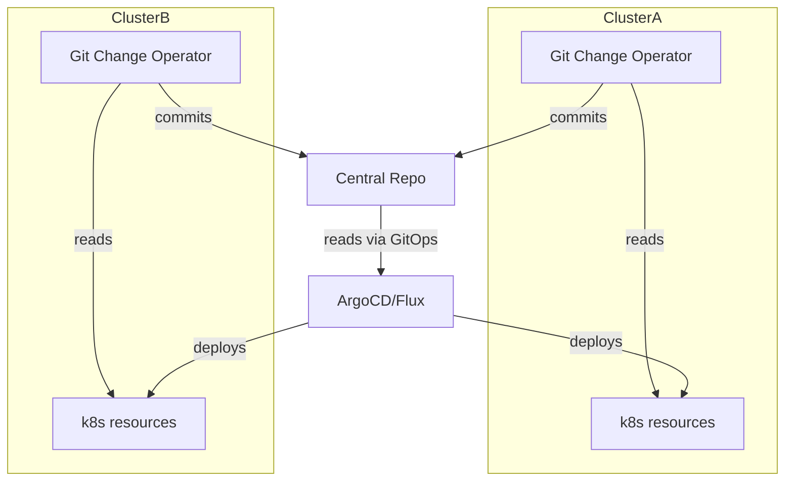

# Advanced Scenarios

This section covers complex use cases and advanced configurations for the Git Change Operator in production environments.

## Multi-Cluster Configuration Sync

Synchronize configurations across multiple Kubernetes clusters using a centralized Git repository.

### Architecture Overview



### Central Configuration Repository Structure

```
k8s-multi-cluster-config/
├── clusters/
│   ├── production/
│   │   ├── applications/
│   │   ├── infrastructure/
│   │   └── secrets/
│   ├── staging/
│   │   ├── applications/
│   │   ├── infrastructure/
│   │   └── secrets/
│   └── development/
│       ├── applications/
│       ├── infrastructure/
│       └── secrets/
├── shared/
│   ├── base-configs/
│   └── policies/
└── environments/
    ├── prod.yaml
    ├── staging.yaml
    └── dev.yaml
```

### Production Cluster GitCommit

```yaml
apiVersion: git.galos.one/v1
kind: GitCommit
metadata:
  name: prod-cluster-sync
  namespace: git-change-operator-system
spec:
  repository:
    url: "https://github.com/company/k8s-multi-cluster-config.git"
    branch: "main"
    
  auth:
    secretName: "git-credentials"
    
  commit:
    author: "Production Cluster <prod-k8s@company.com>"
    message: "Sync production cluster configuration"
    
  files:
    - path: "clusters/production/cluster-info.yaml"
      content: |
        cluster:
          name: "production-east-1"
          version: "1.28.0"
          region: "us-east-1"
          last_sync: "2023-10-01T10:00:00Z"
          
  resourceReferences:
    # Application configurations
    - name: "app-config"
      apiVersion: "v1"
      kind: "ConfigMap"
      namespace: "production"
      strategy: "fields"
      output:
        path: "clusters/production/applications/"
        
    # Infrastructure settings
    - name: "infra-config"
      apiVersion: "v1"
      kind: "ConfigMap"
      namespace: "kube-system"
      strategy: "dump"
      output:
        path: "clusters/production/infrastructure/infra-config.yaml"
        
    # Network policies
    - name: "network-policies"
      apiVersion: "networking.k8s.io/v1"
      kind: "NetworkPolicy"
      namespace: "production"
      strategy: "dump"
      output:
        path: "clusters/production/network-policies.yaml"
```

## Configuration Drift Detection

Implement automated detection and correction of configuration drift between clusters.

### Drift Detection GitCommit

```yaml
apiVersion: git.galos.one/v1
kind: GitCommit
metadata:
  name: drift-detection
spec:
  repository:
    url: "https://github.com/company/config-drift-reports.git"
    
  auth:
    secretName: "git-credentials"
    
  commit:
    author: "Drift Detector <drift@company.com>"
    message: "Configuration drift report - $(date)"
    
  writeMode: "append"  # Accumulate drift reports
  
  files:
    - path: "reports/drift-summary.log"
      content: |
        === Drift Detection Report: 2023-10-01T10:00:00Z ===
        Cluster: production-east-1
        Baseline: staging-approved-configs
        
  resourceReferences:
    # Current production config
    - name: "current-config"
      apiVersion: "v1"
      kind: "ConfigMap"
      namespace: "production"
      strategy: "dump"
      output:
        path: "snapshots/production/current-config-$(date +%Y%m%d).yaml"
        
    # Expected configuration from staging
    - name: "expected-config"
      apiVersion: "v1"
      kind: "ConfigMap"
      namespace: "staging"
      strategy: "dump"
      output:
        path: "snapshots/expected/staging-config-$(date +%Y%m%d).yaml"
```

## Disaster Recovery Automation

Automate backup and restore procedures using GitCommit resources.

### Complete Cluster Backup

```yaml
apiVersion: git.galos.one/v1
kind: GitCommit
metadata:
  name: disaster-recovery-backup
spec:
  repository:
    url: "https://github.com/company/cluster-backups.git"
    branch: "backups/production"
    
  auth:
    secretName: "backup-credentials"
    
  commit:
    author: "Disaster Recovery <dr@company.com>"
    message: "Full cluster backup - $(date)"
    
  files:
    - path: "backup-metadata/$(date +%Y%m%d)/cluster-info.yaml"
      content: |
        backup:
          timestamp: "2023-10-01T10:00:00Z"
          cluster: "production-east-1"
          kubernetes_version: "1.28.0"
          backup_type: "full"
          retention_days: 90
          
  resourceReferences:
    # Backup all ConfigMaps
    - name: "app-config"
      apiVersion: "v1"
      kind: "ConfigMap"
      namespace: "production"
      strategy: "dump"
      output:
        path: "backups/$(date +%Y%m%d)/configmaps/app-config.yaml"
        
    # Backup critical secrets (metadata only)
    - name: "tls-certificates"
      apiVersion: "v1"
      kind: "Secret"
      namespace: "production"
      strategy: "single-field"
      field: "tls.crt"  # Only certificate, not private key
      output:
        path: "backups/$(date +%Y%m%d)/certificates/tls.crt"
        
    # Backup persistent volume claims
    - name: "database-pvc"
      apiVersion: "v1"
      kind: "PersistentVolumeClaim"
      namespace: "production"
      strategy: "dump"
      output:
        path: "backups/$(date +%Y%m%d)/storage/database-pvc.yaml"
```

## GitOps Workflow Integration

Integrate with GitOps tools for complete CI/CD automation.

### ArgoCD Application Sync

```yaml
apiVersion: git.galos.one/v1
kind: PullRequest
metadata:
  name: argocd-app-sync
spec:
  repository:
    url: "https://github.com/company/gitops-applications.git"
    baseBranch: "main"
    
  auth:
    secretName: "github-token"
    
  pullRequest:
    title: "🔄 Sync Application Manifests from Cluster"
    body: |
      ## ArgoCD Application Sync
      
      This PR synchronizes actual cluster state with GitOps repository.
      
      ### Changes Include:
      - Updated resource specifications
      - New application configurations
      - Scaling adjustments
      
      ### ArgoCD Applications Affected:
      - `production/web-app`
      - `production/api-service`  
      - `production/database`
      
      **Auto-merge**: ✅ (if all checks pass)
      
    branchPrefix: "argocd-sync"
    
  resourceReferences:
    # Sync web application
    - name: "web-app"
      apiVersion: "apps/v1"
      kind: "Deployment"
      namespace: "production"
      strategy: "dump"
      output:
        path: "applications/web-app/deployment.yaml"
        
    # Sync API service
    - name: "api-service"
      apiVersion: "v1"
      kind: "Service"
      namespace: "production"
      strategy: "dump"
      output:
        path: "applications/api-service/service.yaml"
        
    # Sync ingress configuration
    - name: "main-ingress"
      apiVersion: "networking.k8s.io/v1"
      kind: "Ingress"
      namespace: "production"
      strategy: "dump"
      output:
        path: "networking/ingress.yaml"
```

### Prometheus Operator Integration

```yaml
apiVersion: git.galos.one/v1
kind: GitCommit
metadata:
  name: prometheus-config-backup
spec:
  repository:
    url: "https://github.com/company/monitoring-configs.git"
    
  auth:
    secretName: "git-credentials"
    
  commit:
    author: "Monitoring Operator <monitoring@company.com>"
    message: "Backup Prometheus monitoring configuration"
    
  resourceReferences:
    # Export Prometheus rules
    - name: "app-rules"
      apiVersion: "monitoring.coreos.com/v1"
      kind: "PrometheusRule"
      namespace: "monitoring"
      strategy: "dump"
      output:
        path: "prometheus/rules/app-rules.yaml"
        
    # Export ServiceMonitor configurations
    - name: "api-service-monitor"
      apiVersion: "monitoring.coreos.com/v1"
      kind: "ServiceMonitor"
      namespace: "production"
      strategy: "dump"
      output:
        path: "prometheus/service-monitors/api-service.yaml"
        
    # Export AlertManager configuration
    - name: "alertmanager-config"
      apiVersion: "v1"
      kind: "Secret"
      namespace: "monitoring"
      strategy: "single-field"
      field: "alertmanager.yml"
      output:
        path: "alertmanager/config.yml"
```

## Performance and Scale Optimization

Optimize for large-scale deployments and high-frequency updates.

### Batched Configuration Updates

```yaml
apiVersion: git.galos.one/v1
kind: GitCommit
metadata:
  name: batch-config-update
spec:
  repository:
    url: "https://github.com/company/config-batches.git"
    
  auth:
    secretName: "git-credentials"
    
  commit:
    author: "Batch Processor <batch@company.com>"
    message: "Batched configuration update - $(date)"
    
  # Use overwrite for clean batches
  writeMode: "overwrite"
  
  files:
    - path: "batch-info.yaml"
      content: |
        batch:
          timestamp: "2023-10-01T10:00:00Z"
          resources_count: 50
          namespaces: ["prod-1", "prod-2", "prod-3"]
          
  resourceReferences:
    # Batch export multiple ConfigMaps
    - name: "app-config-1"
      apiVersion: "v1"
      kind: "ConfigMap"
      namespace: "prod-1"
      strategy: "fields"
      output:
        path: "batch-1/prod-1/"
        
    - name: "app-config-2"
      apiVersion: "v1"
      kind: "ConfigMap"
      namespace: "prod-2"
      strategy: "fields"
      output:
        path: "batch-1/prod-2/"
        
    - name: "app-config-3"
      apiVersion: "v1"
      kind: "ConfigMap"
      namespace: "prod-3"
      strategy: "fields"
      output:
        path: "batch-1/prod-3/"
```

## Error Recovery and Retry Logic

Implement robust error handling for production workloads.

### Resilient Configuration Sync

```yaml
apiVersion: git.galos.one/v1
kind: GitCommit
metadata:
  name: resilient-sync
  annotations:
    # Custom annotation for retry behavior
    git.galos.one/retry-policy: "exponential-backoff"
    git.galos.one/max-retries: "5"
spec:
  repository:
    url: "https://github.com/company/resilient-configs.git"
    
  auth:
    secretName: "git-credentials"
    
  commit:
    author: "Resilient Sync <resilient@company.com>"
    message: "Resilient configuration sync with error recovery"
    
  files:
    - path: "sync-status/last-attempt.yaml"
      content: |
        sync:
          timestamp: "2023-10-01T10:00:00Z"
          attempt: 1
          status: "in-progress"
          
  resourceReferences:
    # Critical configuration that must be synced
    - name: "critical-config"
      apiVersion: "v1"
      kind: "ConfigMap"
      namespace: "production"
      strategy: "dump"
      output:
        path: "critical/config.yaml"
        
    # Optional configuration (can fail without blocking)
    - name: "optional-config"
      apiVersion: "v1"
      kind: "ConfigMap"
      namespace: "production"
      strategy: "fields"
      output:
        path: "optional/"
```

## Monitoring and Observability

Implement comprehensive monitoring for GitCommit operations.

### Metrics Collection GitCommit

```yaml
apiVersion: git.galos.one/v1
kind: GitCommit
metadata:
  name: metrics-collection
spec:
  repository:
    url: "https://github.com/company/operator-metrics.git"
    
  auth:
    secretName: "git-credentials"
    
  commit:
    author: "Metrics Collector <metrics@company.com>"
    message: "Collect operator performance metrics"
    
  writeMode: "append"
  
  files:
    - path: "metrics/$(date +%Y%m%d)/operator-performance.log"
      content: |
        timestamp: 2023-10-01T10:00:00Z
        reconciliation_duration: 2.5s
        resources_processed: 15
        git_operations: 3
        
  resourceReferences:
    # Collect operator metrics from ConfigMap
    - name: "operator-metrics"
      apiVersion: "v1"
      kind: "ConfigMap"
      namespace: "git-change-operator-system"
      strategy: "single-field"
      field: "prometheus-metrics"
      output:
        path: "metrics/$(date +%Y%m%d)/prometheus.txt"
```

## Best Practices Summary

### Resource Organization
- Use clear naming conventions
- Separate concerns with different GitCommit resources
- Group related configurations together

### Security
- Never export actual secret values
- Use separate repositories for sensitive data
- Implement proper RBAC controls

### Performance
- Batch related updates together
- Use appropriate write modes
- Monitor resource consumption

### Reliability
- Implement retry logic
- Use health checks
- Monitor operator logs

### Compliance
- Maintain audit trails
- Regular configuration backups
- Document all changes

## Next Steps

- [Error Handling Reference](../reference/error-handling.md) - Troubleshooting production issues