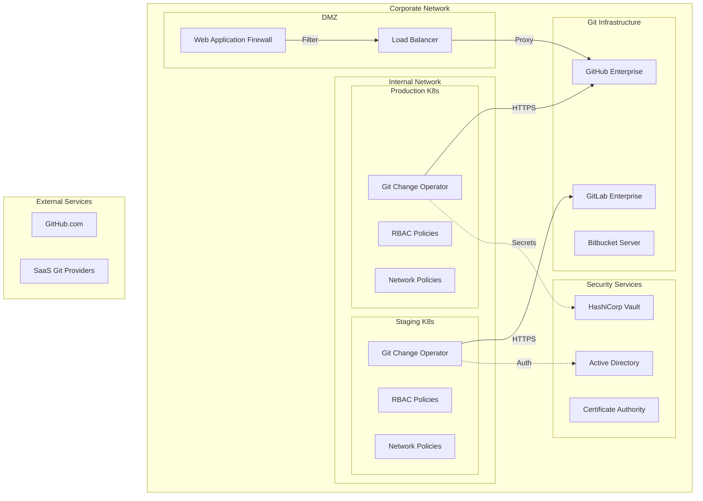

# Corporate Environment Setup

This guide covers enterprise deployment patterns, security considerations, and compliance requirements for the Git Change Operator in corporate environments.

## Enterprise Architecture Overview



## Security Configuration

### Vault Integration for Secrets Management

```yaml
# External Secrets Operator configuration
apiVersion: external-secrets.io/v1beta1
kind: SecretStore
metadata:
  name: vault-secret-store
  namespace: git-change-operator-system
spec:
  provider:
    vault:
      server: "https://vault.corp.internal:8200"
      path: "secret"
      version: "v2"
      auth:
        kubernetes:
          mountPath: "kubernetes"
          role: "git-change-operator"
          serviceAccountRef:
            name: "git-change-operator-controller-manager"

---
apiVersion: external-secrets.io/v1beta1
kind: ExternalSecret
metadata:
  name: git-credentials
  namespace: git-change-operator-system
spec:
  refreshInterval: 15s
  secretStoreRef:
    name: vault-secret-store
    kind: SecretStore
  target:
    name: git-credentials
    creationPolicy: Owner
  data:
  - secretKey: username
    remoteRef:
      key: git-credentials
      property: username
  - secretKey: password
    remoteRef:
      key: git-credentials
      property: password
```

### Network Policies for Isolation

```yaml
apiVersion: networking.k8s.io/v1
kind: NetworkPolicy
metadata:
  name: git-change-operator-network-policy
  namespace: git-change-operator-system
spec:
  podSelector:
    matchLabels:
      control-plane: controller-manager
  policyTypes:
  - Ingress
  - Egress
  ingress:
  - from:
    - namespaceSelector:
        matchLabels:
          name: kube-system
    ports:
    - protocol: TCP
      port: 8443  # Webhook port
  egress:
  # Allow DNS resolution
  - to: []
    ports:
    - protocol: UDP
      port: 53
  # Allow access to Kubernetes API
  - to:
    - namespaceSelector:
        matchLabels:
          name: kube-system
    ports:
    - protocol: TCP
      port: 443
  # Allow access to corporate Git servers
  - to: []
    ports:
    - protocol: TCP
      port: 443
    - protocol: TCP
      port: 22  # SSH if needed
```

### RBAC Configuration

```yaml
apiVersion: rbac.authorization.k8s.io/v1
kind: ClusterRole
metadata:
  name: git-change-operator-manager-role
rules:
# Core GitCommit/PullRequest operations
- apiGroups: ["git.galos.one"]
  resources: ["gitcommits", "pullrequests"]
  verbs: ["get", "list", "watch", "create", "update", "patch", "delete"]
- apiGroups: ["git.galos.one"]
  resources: ["gitcommits/status", "pullrequests/status"]
  verbs: ["get", "update", "patch"]

# Read-only access to standard resources
- apiGroups: [""]
  resources: ["configmaps", "secrets"]
  verbs: ["get", "list", "watch"]
- apiGroups: ["apps"]
  resources: ["deployments", "replicasets", "statefulsets"]
  verbs: ["get", "list", "watch"]

# Custom resources (add as needed)
- apiGroups: ["monitoring.coreos.com"]
  resources: ["servicemonitors", "prometheusrules"]
  verbs: ["get", "list", "watch"]
- apiGroups: ["networking.istio.io"]
  resources: ["virtualservices", "destinationrules"]
  verbs: ["get", "list", "watch"]

---
apiVersion: rbac.authorization.k8s.io/v1
kind: Role
metadata:
  namespace: production
  name: git-change-operator-production-role
rules:
# Namespace-specific access for production
- apiGroups: [""]
  resources: ["configmaps"]
  resourceNames: ["app-config", "database-config"]
  verbs: ["get"]
- apiGroups: [""]
  resources: ["secrets"]
  resourceNames: ["api-credentials"]
  verbs: ["get"]
```

## Corporate Git Integration

### GitHub Enterprise Setup

```yaml
apiVersion: git.galos.one/v1
kind: GitCommit
metadata:
  name: github-enterprise-sync
spec:
  repository:
    url: "https://github.corp.internal/platform/k8s-configs.git"
    branch: "main"
    
  auth:
    secretName: "github-enterprise-credentials"
    
  commit:
    author: "K8s Platform <platform@corp.internal>"
    message: "Automated sync from production cluster"
    
  files:
    - path: "metadata/cluster-info.yaml"
      content: |
        cluster:
          name: "prod-east-1"
          environment: "production"
          compliance_zone: "pci-dss"
          last_sync: "2023-10-01T10:00:00Z"
          
  resourceReferences:
    # Export approved production configurations
    - name: "production-config"
      apiVersion: "v1"
      kind: "ConfigMap"
      namespace: "production"
      strategy: "fields"
      output:
        path: "production/configs/"
```

### GitLab Enterprise Integration

```yaml
apiVersion: git.galos.one/v1
kind: PullRequest
metadata:
  name: gitlab-compliance-report
spec:
  repository:
    url: "https://gitlab.corp.internal/compliance/audit-reports.git"
    baseBranch: "main"
    
  auth:
    secretName: "gitlab-enterprise-token"
    
  pullRequest:
    title: "🔒 Quarterly Compliance Report - Q4 2023"
    body: |
      ## Compliance Audit Report
      
      **Compliance Framework**: SOC2 Type II, PCI-DSS Level 1
      **Audit Period**: Q4 2023
      **Cluster**: Production East-1
      
      ### Security Controls Verified:
      - [x] Access controls and RBAC
      - [x] Network segmentation policies  
      - [x] Encryption in transit and at rest
      - [x] Audit logging and monitoring
      - [x] Incident response procedures
      
      ### Compliance Status: ✅ PASS
      
      **Auditor**: Automated Compliance System
      **Next Review**: Q1 2024
      
    branchPrefix: "compliance-q4-2023"
    
  resourceReferences:
    # Export security policies for audit
    - name: "security-policies"
      apiVersion: "v1"
      kind: "ConfigMap"
      namespace: "security"
      strategy: "dump"
      output:
        path: "q4-2023/security-policies.yaml"
```

## Compliance and Governance

### SOC2 Compliance Configuration

```yaml
apiVersion: git.galos.one/v1
kind: GitCommit
metadata:
  name: soc2-daily-report
spec:
  repository:
    url: "https://github.corp.internal/compliance/soc2-reports.git"
    branch: "daily-reports"
    
  auth:
    secretName: "compliance-credentials"
    
  commit:
    author: "SOC2 Compliance Bot <soc2@corp.internal>"
    message: "Daily SOC2 compliance report - $(date +%Y-%m-%d)"
    
  writeMode: "append"
  
  files:
    - path: "daily-reports/$(date +%Y%m)/$(date +%d)-summary.log"
      content: |
        === SOC2 Daily Compliance Check ===
        Date: $(date +%Y-%m-%d)
        Time: $(date +%H:%M:%S) UTC
        
        Control Categories:
        - Access Control: PASS
        - Change Management: PASS  
        - System Monitoring: PASS
        - Incident Response: PASS
        
  resourceReferences:
    # Daily access control audit
    - name: "rbac-audit"
      apiVersion: "v1"
      kind: "ConfigMap"
      namespace: "kube-system"
      strategy: "single-field"
      field: "daily-audit-report"
      output:
        path: "daily-reports/$(date +%Y%m)/$(date +%d)-rbac-audit.txt"
        
    # Network policy compliance
    - name: "network-compliance"
      apiVersion: "v1"
      kind: "ConfigMap"
      namespace: "security"
      strategy: "fields"
      output:
        path: "daily-reports/$(date +%Y%m)/$(date +%d)-network/"
```

### PCI-DSS Configuration Management

```yaml
apiVersion: git.galos.one/v1
kind: GitCommit
metadata:
  name: pci-dss-configuration
spec:
  repository:
    url: "https://github.corp.internal/compliance/pci-dss-configs.git"
    
  auth:
    secretName: "pci-compliance-credentials"
    
  commit:
    author: "PCI-DSS Compliance <pci@corp.internal>"
    message: "PCI-DSS configuration update - $(date)"
    
  files:
    - path: "pci-scope/cardholder-data-environment.yaml"
      content: |
        pci_scope:
          environment: "cardholder-data-environment"
          compliance_level: "Level 1"
          last_assessment: "2023-09-15"
          next_assessment: "2024-09-15"
          
  resourceReferences:
    # Export PCI-compliant network policies
    - name: "pci-network-policies"
      apiVersion: "networking.k8s.io/v1"
      kind: "NetworkPolicy"
      namespace: "pci-scope"
      strategy: "dump"
      output:
        path: "network-policies/pci-network-policies.yaml"
        
    # Export encryption configuration
    - name: "encryption-config"
      apiVersion: "v1"
      kind: "ConfigMap"
      namespace: "pci-scope"
      strategy: "single-field"
      field: "encryption-standards"
      output:
        path: "encryption/standards.yaml"
```

## Multi-Region Deployment

### Cross-Region Configuration Sync

```yaml
apiVersion: git.galos.one/v1
kind: GitCommit
metadata:
  name: cross-region-sync
spec:
  repository:
    url: "https://github.corp.internal/infrastructure/multi-region-configs.git"
    branch: "region-east-1"
    
  auth:
    secretName: "multi-region-credentials"
    
  commit:
    author: "Multi-Region Sync <multiregion@corp.internal>"
    message: "Sync configuration from region east-1"
    
  files:
    - path: "regions/east-1/region-info.yaml"
      content: |
        region:
          name: "east-1"
          primary: true
          availability_zones: ["east-1a", "east-1b", "east-1c"]
          disaster_recovery_target: "west-2"
          
  resourceReferences:
    # Regional database configuration
    - name: "regional-db-config"
      apiVersion: "v1"
      kind: "ConfigMap"
      namespace: "production"
      strategy: "fields"
      output:
        path: "regions/east-1/database/"
        
    # Regional load balancer settings
    - name: "lb-config"
      apiVersion: "v1"
      kind: "ConfigMap"
      namespace: "ingress-system"
      strategy: "dump"
      output:
        path: "regions/east-1/load-balancer.yaml"
```

## Enterprise Monitoring Integration

### SIEM Integration

```yaml
apiVersion: git.galos.one/v1
kind: GitCommit
metadata:
  name: siem-log-export
spec:
  repository:
    url: "https://github.corp.internal/security/siem-logs.git"
    
  auth:
    secretName: "siem-credentials"
    
  commit:
    author: "SIEM Integration <siem@corp.internal>"
    message: "Export security logs for SIEM analysis"
    
  writeMode: "append"
  
  files:
    - path: "logs/k8s-events/$(date +%Y%m%d)/events.log"
      content: |
        # Kubernetes Events Export for SIEM
        # Timestamp: $(date +%Y-%m-%d %H:%M:%S)
        # Source: Production Kubernetes Cluster
        
  resourceReferences:
    # Export audit logs
    - name: "audit-logs"
      apiVersion: "v1"
      kind: "ConfigMap"
      namespace: "kube-system"
      strategy: "single-field"
      field: "audit.log"
      output:
        path: "logs/audit/$(date +%Y%m%d)/kubernetes-audit.log"
        
    # Export security events
    - name: "security-events"
      apiVersion: "v1"
      kind: "ConfigMap"
      namespace: "security"
      strategy: "fields"
      output:
        path: "logs/security-events/$(date +%Y%m%d)/"
```

### Splunk Integration

```yaml
apiVersion: git.galos.one/v1
kind: GitCommit
metadata:
  name: splunk-data-export
spec:
  repository:
    url: "https://github.corp.internal/monitoring/splunk-data.git"
    
  auth:
    secretName: "splunk-integration-credentials"
    
  commit:
    author: "Splunk Integration <splunk@corp.internal>"
    message: "Export operational data for Splunk indexing"
    
  writeMode: "append"
  
  resourceReferences:
    # Export application metrics
    - name: "app-metrics"
      apiVersion: "v1"
      kind: "ConfigMap"
      namespace: "monitoring"
      strategy: "single-field"
      field: "prometheus-metrics"
      output:
        path: "metrics/$(date +%Y%m%d)/prometheus.txt"
        
    # Export performance data
    - name: "performance-data"
      apiVersion: "v1"
      kind: "ConfigMap"
      namespace: "monitoring"
      strategy: "fields"
      output:
        path: "performance/$(date +%Y%m%d)/"
```

## Change Management Integration

### ServiceNow Integration

```yaml
apiVersion: git.galos.one/v1
kind: PullRequest
metadata:
  name: servicenow-change-request
spec:
  repository:
    url: "https://github.corp.internal/change-management/change-records.git"
    baseBranch: "main"
    
  auth:
    secretName: "change-management-credentials"
    
  pullRequest:
    title: "🎫 Change Request: Production Configuration Update"
    body: |
      ## ServiceNow Change Request
      
      **Change Request ID**: CHG0001234
      **Risk Level**: Low
      **Implementation Window**: 2023-10-01 02:00-04:00 UTC
      
      ### Change Description:
      Automated configuration update for production applications
      following approved change management process.
      
      ### Impact Assessment:
      - **Systems Affected**: Production Kubernetes cluster
      - **Expected Downtime**: None (rolling update)
      - **Rollback Plan**: Automated via GitOps
      
      ### Approvals Required:
      - [x] Technical Review: @platform-team
      - [x] Security Review: @security-team
      - [ ] Change Advisory Board: @cab-team
      
      **ServiceNow Link**: https://corp.service-now.com/change/CHG0001234
      
    branchPrefix: "chg-0001234"
    
  files:
    - path: "change-records/CHG0001234/metadata.yaml"
      content: |
        change_request:
          id: "CHG0001234"
          title: "Production Configuration Update"
          requestor: "platform-team@corp.internal"
          implementation_date: "2023-10-01T02:00:00Z"
          
  resourceReferences:
    # Document current configuration state
    - name: "current-prod-config"
      apiVersion: "v1"
      kind: "ConfigMap"
      namespace: "production"
      strategy: "dump"
      output:
        path: "change-records/CHG0001234/before-state.yaml"
```

## Disaster Recovery Automation

### DR Site Configuration Sync

```yaml
apiVersion: git.galos.one/v1
kind: GitCommit
metadata:
  name: dr-configuration-sync
spec:
  repository:
    url: "https://github.corp.internal/disaster-recovery/configuration-backup.git"
    branch: "dr-site-west-2"
    
  auth:
    secretName: "dr-credentials"
    
  commit:
    author: "DR Automation <dr@corp.internal>"
    message: "Disaster recovery configuration sync - $(date)"
    
  files:
    - path: "dr-metadata/sync-info.yaml"
      content: |
        disaster_recovery:
          primary_site: "east-1"
          dr_site: "west-2"
          rpo_minutes: 15
          rto_minutes: 60
          last_sync: "$(date -u +%Y-%m-%dT%H:%M:%SZ)"
          
  resourceReferences:
    # Critical production configurations
    - name: "critical-app-config"
      apiVersion: "v1"
      kind: "ConfigMap"
      namespace: "production"
      strategy: "dump"
      output:
        path: "critical-configs/app-config.yaml"
        
    # Database connection strings for DR
    - name: "database-dr-config"
      apiVersion: "v1"
      kind: "Secret"
      namespace: "production"
      strategy: "single-field"
      field: "dr-connection-string"
      output:
        path: "database/dr-connection.txt"
```

## Performance and Scaling

### Enterprise Scale Configuration

```yaml
# Operator deployment with enterprise settings
apiVersion: apps/v1
kind: Deployment
metadata:
  name: git-change-operator-controller-manager
  namespace: git-change-operator-system
spec:
  replicas: 3  # High availability
  template:
    spec:
      containers:
      - name: manager
        image: git-change-operator:enterprise
        resources:
          requests:
            memory: "512Mi"
            cpu: "500m"
          limits:
            memory: "2Gi"  
            cpu: "2000m"
        env:
        - name: RECONCILE_WORKERS
          value: "10"  # Increased concurrency
        - name: GIT_TIMEOUT
          value: "300s"  # Extended timeout for large repos
        - name: MAX_RESOURCE_REFS
          value: "100"  # Support more resource references
```

### Load Balancing for Git Operations

```yaml
apiVersion: git.galos.one/v1
kind: GitCommit
metadata:
  name: load-balanced-sync
  annotations:
    git.galos.one/repository-pool: "enterprise-pool"
spec:
  repository:
    # Use load-balanced Git endpoint
    url: "https://git-lb.corp.internal/configs/production.git"
    
  auth:
    secretName: "enterprise-git-credentials"
    
  commit:
    author: "Enterprise Sync <enterprise@corp.internal>"
    message: "Load-balanced configuration sync"
    
  # Large batch configuration
  resourceReferences:
    # Process multiple namespaces efficiently
    - name: "ns-1-config"
      apiVersion: "v1"
      kind: "ConfigMap"
      namespace: "production-1"
      strategy: "fields"
      output:
        path: "namespaces/production-1/"
        
    # ... up to 50+ resource references
```

## Best Practices Summary

### Security
- **Least Privilege**: Grant minimum required permissions
- **Secret Management**: Use enterprise secret management (Vault, etc.)
- **Network Isolation**: Implement network policies and firewalls
- **Audit Trails**: Maintain comprehensive logs for compliance

### Compliance
- **Automated Reporting**: Regular compliance report generation
- **Change Management**: Integration with enterprise change processes
- **Data Classification**: Proper handling of sensitive data
- **Retention Policies**: Automated cleanup and archival

### Operations
- **High Availability**: Multi-replica deployments
- **Monitoring**: Integration with enterprise monitoring tools
- **Disaster Recovery**: Automated DR configuration sync
- **Performance**: Tuned for enterprise scale

### Governance
- **RBAC**: Comprehensive role-based access control
- **Approval Workflows**: Integration with enterprise approval processes
- **Documentation**: Automated documentation generation
- **Quality Gates**: Automated validation and testing

## Next Steps

- [Development Guide](../development/index.md) - Customizing for enterprise needs
- [API Reference](../reference/api.md) - Complete API documentation
- [Error Handling](../reference/error-handling.md) - Enterprise troubleshooting