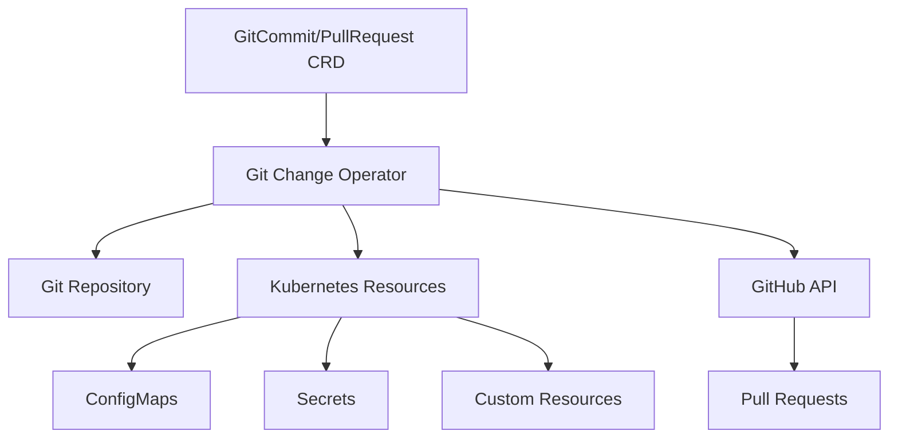

# Git Change Operator

A powerful Kubernetes operator that enables automated Git operations directly from within your cluster. Seamlessly commit files and reference existing Kubernetes resources with flexible output strategies.

## Overview

The Git Change Operator bridges the gap between your Kubernetes cluster state and Git repositories, enabling GitOps workflows where cluster resources can automatically update Git repositories. Whether you need to commit static files, export ConfigMaps, or create pull requests from resource changes, this operator provides the tools you need.

## Key Features

### 🔄 **Automated Git Operations**
- **Direct Commits**: Push files directly to Git repositories
- **Pull Requests**: Create GitHub pull requests with automated branch management
- **Secure Authentication**: Use Kubernetes Secrets for Git authentication

### 📦 **Resource References**
- **Any Kubernetes Resource**: Reference Secrets, ConfigMaps, or any custom resources
- **Flexible Output Strategies**: Choose how to extract and format resource data
- **Smart Field Extraction**: Extract specific fields or entire resources

### 🎯 **Output Strategies**
- **Dump Strategy**: Export entire resources as YAML files
- **Fields Strategy**: Extract all data fields as separate files
- **Single-Field Strategy**: Extract specific fields with custom naming and paths

### ✏️ **Write Modes**
- **Overwrite Mode**: Replace existing file content (default)
- **Append Mode**: Add content to existing files

## Architecture

## Use Cases

### Configuration Management
Export cluster configuration to Git repositories for backup and version control.

### GitOps Workflows
Automatically update Git repositories when cluster state changes, enabling bidirectional GitOps.

### Compliance & Auditing
Maintain Git history of configuration changes for compliance and audit trails.

### Multi-Cluster Synchronization
Share configuration between clusters through Git repositories.

## Quick Navigation

-   :material-rocket-launch:{ .lg .middle } **Get Started**

    ---

    Install the operator and create your first GitCommit resource in minutes.

    [:octicons-arrow-right-24: Quick Start](user-guide/quick-start.md)

-   :material-book-open:{ .lg .middle } **User Guide**

    ---

    Complete guide covering installation, configuration, and usage patterns.

    [:octicons-arrow-right-24: User Guide](user-guide/index.md)

-   :material-code-braces:{ .lg .middle } **Examples**

    ---

    Real-world examples and use cases with complete YAML configurations.

    [:octicons-arrow-right-24: Examples](examples/index.md)

-   :material-api:{ .lg .middle } **API Reference**

    ---

    Complete API documentation and CRD specifications.

    [:octicons-arrow-right-24: Reference](reference/index.md)

## Community & Support

- **GitHub**: [mihaigalos/git-change-operator](https://github.com/mihaigalos/git-change-operator)
- **Issues**: Report bugs and request features on GitHub Issues
- **Discussions**: Join the community discussions for questions and ideas

## License

This project is licensed under the MIT License - see the [LICENSE](https://github.com/mihaigalos/git-change-operator/blob/main/LICENSE) file for details.